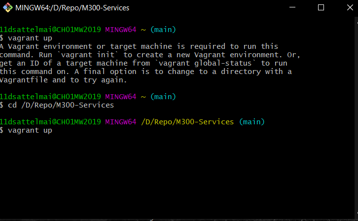
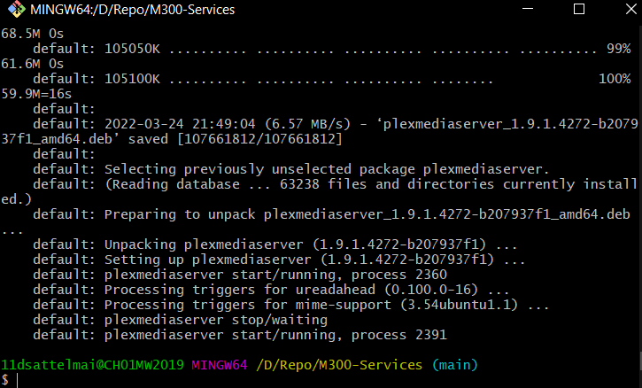
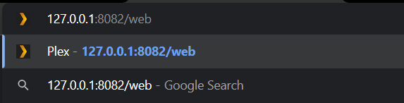
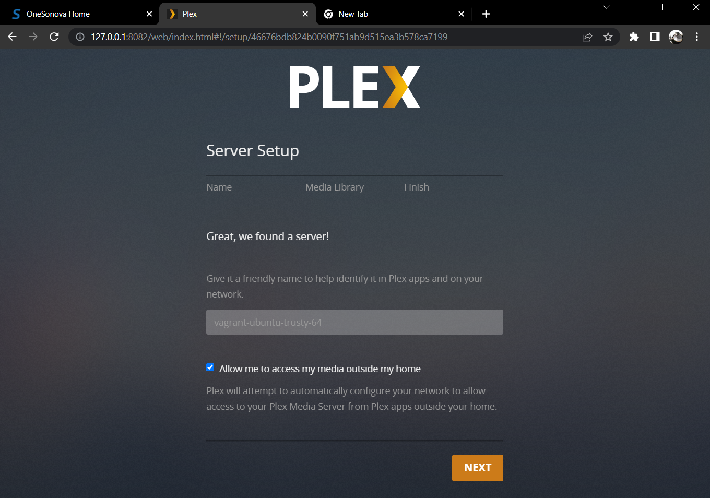

# M300 Services

## Inhaltsverzeichnis 
---
* Einführung
* Dokumentation
* Testing
* Schlusswort
---
## Einführung
---
Bei diesem Projekt habe ich die Automatisierung eines PLEX Servers vorgenommen. PLEX ist ein Multimedia Dienst mit dem man primär lokale Filme aber auch Videos und Fotos in eine Mediathek speichern kann. Diese kann man dann Mit einem Plex Account von extern aufrufen und nutzen.

Diesen Dienst werde ich so automatisieren, dass sobald ich das Vagrant Skript ausgeführt habe man über die Webadresse auf einem Client aufrufe und mich mit einem Plex account anmelden kann.


---
## Dokumentation
---
### Vagrantfile
```Ruby
Vagrant.configure("2") do |config|
  config.vm.box = "ubuntu/trusty64"
  config.vm.network "forwarded_port", guest: 32400, host: 8082
  config.vm.provision "shell", inline: <<-SHELL
  sudo su -
   sudo apt-get update && sudo apt-get -y upgrade
   wget https://downloads.plex.tv/plex-media-server/1.9.1.4272-b207937f1/plexmediaserver_1.9.1.4272-b207937f1_amd64.deb
   sudo dpkg -i plexmediaserver*.deb
   service plexmediaserver restart
   mkdir /plex-images
   mkdir /plex-shows
   mkdir /plex-videos
   mkdir /plex-music
  SHELL
end
```
Bei Vagrant kann man der einfachkeithalber eine Box zu seinem Skript hinzufügen, welche das Betriebssystem vorbereitet. 

Danach habe ich die weitergeleiteten Ports eingestellt. Da Plex denn port 8082 und 32400 braucht um zu funktionieren. 

Als letztes kam der Bash code um die installation von Plex und das vorbereiten der Ordner damit man als User diese nutzen kann.

---
## Testing




1. Nachdem ich das Skript fertig geschrieben habe, führe ich das Vagrant skript aus indem ich Git bash öffnete, in das richtige Verzeichnis ging und "vagrant up" ausführte.




2. Alles hat funktioniert und die VM ist gestartet




3. Um das Plex Webinterface zu erreichen muss man diese Adresse eingeben.




Und So sieht das Plex Webinterface aus wenn alles richtig geklappt hat. Nun Kann man sich mit seinem Account einloggen und Plex einrichten.

---
## Schlusswort
---

Ich wollte die Konfiguration Plex ebenfalls ins Skript einbauen, dass war leider nicht möglich weil ich herausgefunden habe, dass die Konfiguration Account basiert ist und keine Konfigurationsmöglichkeit im Terminal existiert.