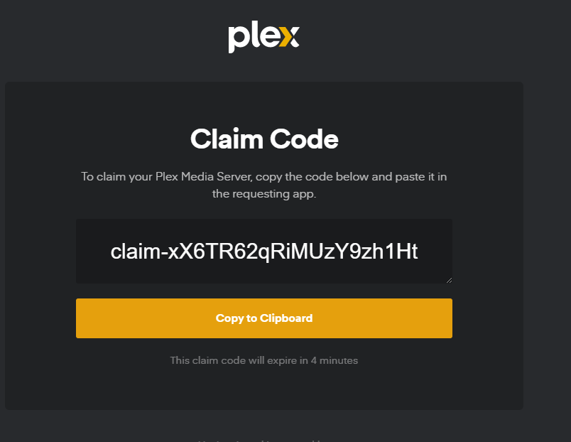
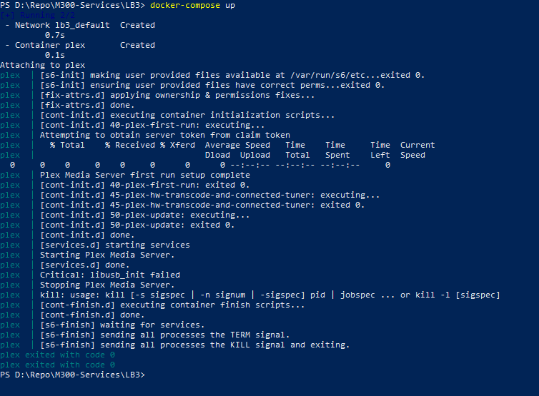
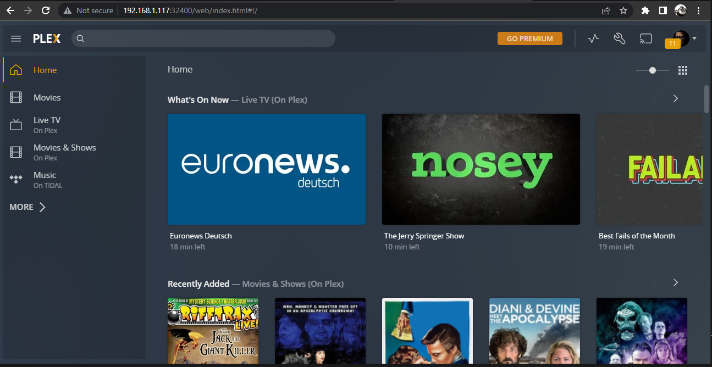

# LB03

## Inhaltsverzeichnis 
---
* Einführung
* Dokumentation
* Testing
* Schlusswort
---
## Einführung
---

Bei diesem Projekt habe ich mich wieder für einen Plex Server entschieden. Dies ist dadurch zu stande gekommen,
weil ich zuerst versucht habe das Kubernetes Projekt zu machen, was aber mir nicht gelungen ist.

Ich werde mit Docker einen Container erstellen der den Plex Server erstellt und allen nötigen Configurationen, damit
man sich einloggen kann und direkt loslegen.

---
## Dokumentation
---
### Docker Compose YAML File
``` version: '2'
services:
  plex:
    container_name: plex
    image: plexinc/pms-docker
    restart: unless-stopped
    ports:
      - 32400:32400/tcp
      - 3005:3005/tcp
      - 8324:8324/tcp
      - 32469:32469/tcp
      - 1900:1900/udp
      - 32410:32410/udp
      - 32412:32412/udp
      - 32413:32413/udp
      - 32414:32414/udp
    environment:
      - TZ=Europe/Zurich
      - PLEX_CLAIM=claim-Ms7XVimBbkkyUB4-Efmu
      - ADVERTISE_IP=http://192.168.1.117:32400/
    hostname: plexserver.example.com
    volumes:
      - /plex/database:/config
      - /plex/transcode:/transcode
      - /plex/media:/data
```
Bevor der Code zum laufen gebracht werden kann muss der Punkt PLEX_CLAIM angepasst werden, damit die automatische anmeldung erfolgen kann.

Diesen claim tokken kann man unter https://www.plex.tv/claim anfordern wenn man sich mit seinem PLEX account anmeldet.



---
## Testing

1. Nachdem ich das Skript fertig geschrieben habe, habe ich den container mit docker-compose up gestartet.
Nach dem Testen habe ich diesen gestoppt wie man in den letzten Zeilen sieht.

Wie an sieht ist der Container erfolgreich gestartet.
Die letze Ausgabe war eine critical ausgabe welche ich nicht nachvolziehen kann, da PLEX geloffen ist.



2. Das Plex interface erreicht man, wenn man "ip adresse":32400/web eingibt.




---
## Schlusswort
---

Genrell bin ich nicht sehr befriedigt, weil ich ursprünglich Kubernetes machen wollte. 
Dies war aufgrund meiner mangelnden Erfahrung zeitlich nicht mehr möglich.
Dennoch hat es spass gemacht mit Docker zu arbeiten und die PLEX Konfiguration war mit Docker besser zu realisieren. 